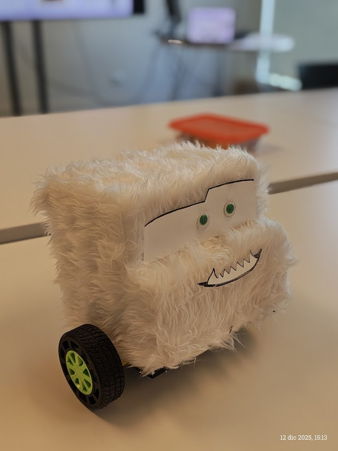
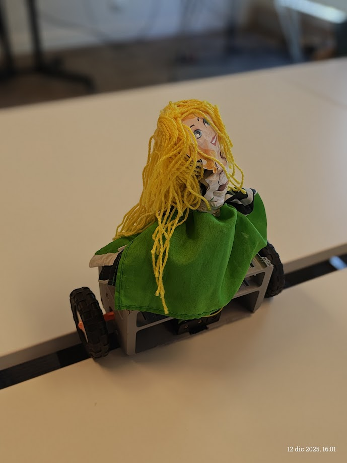
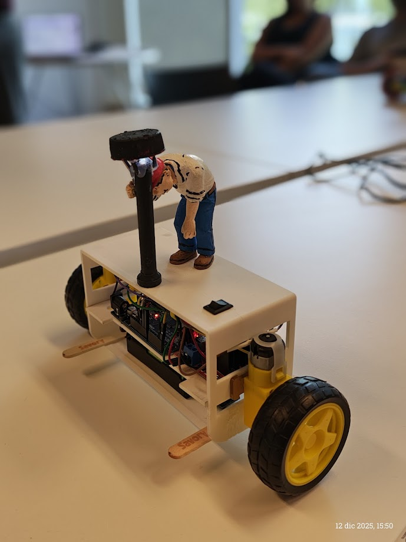
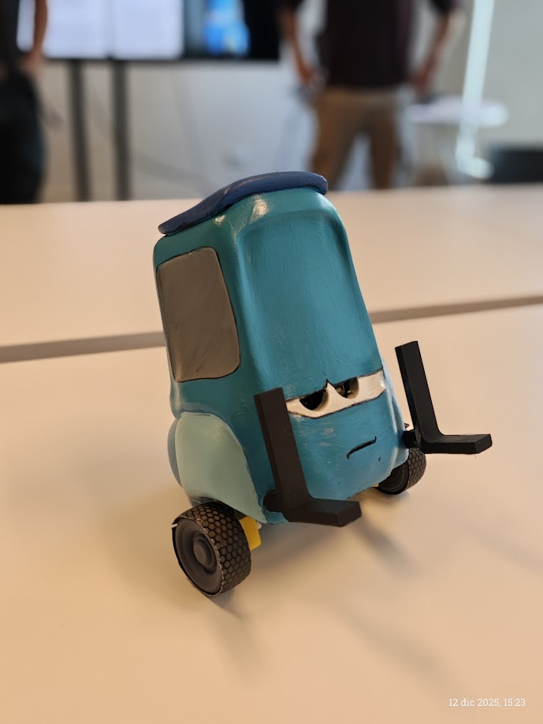
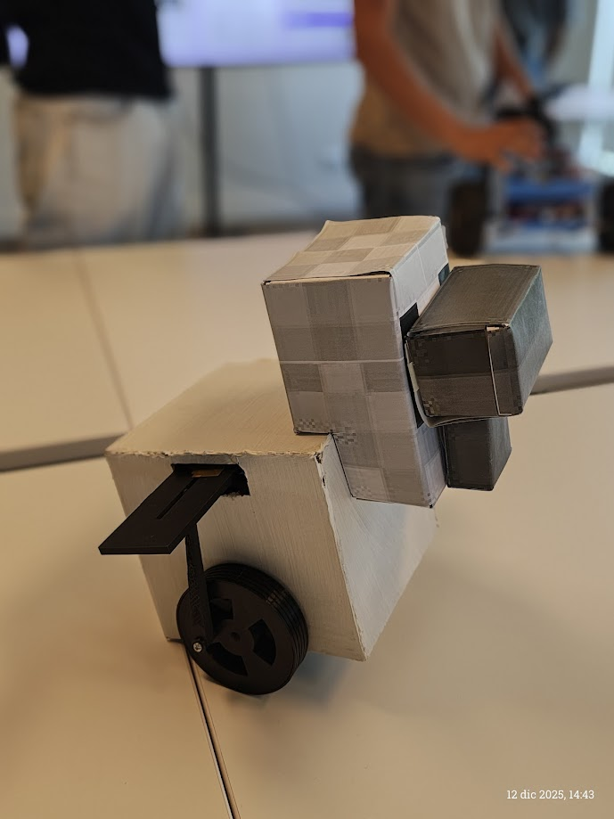
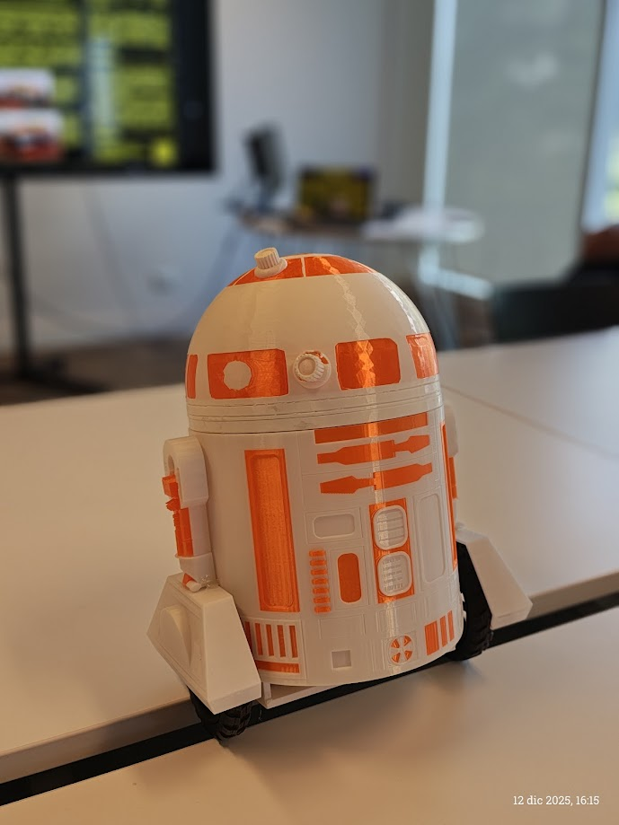
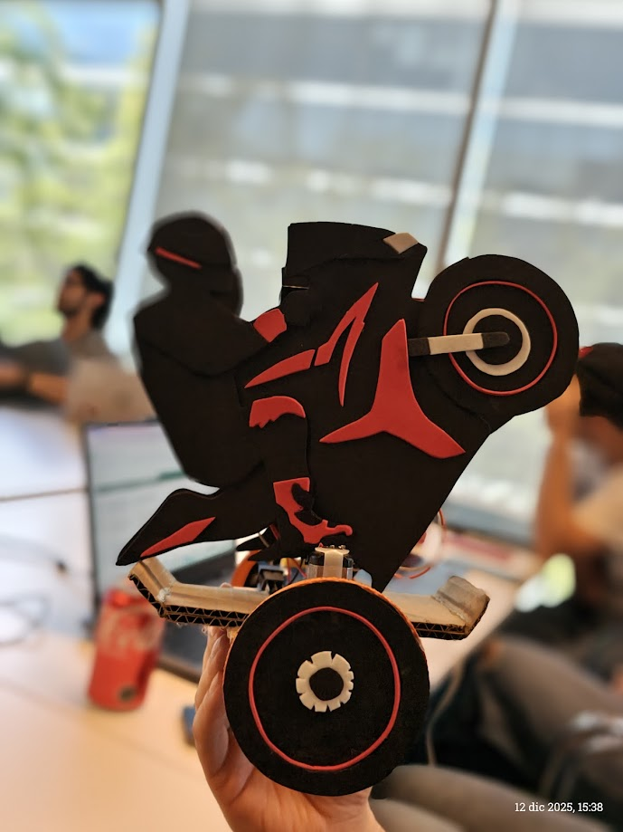
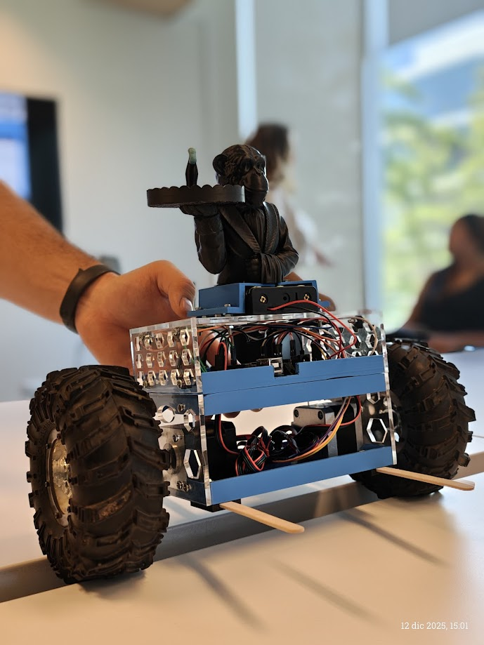
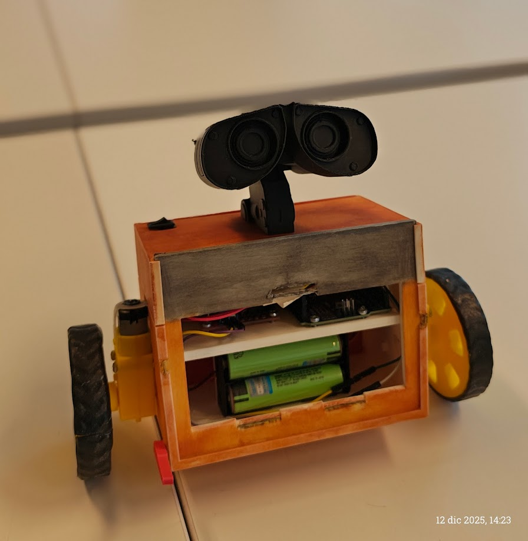

# ME4250 - Mecatrónica
## Semestre 2025-2

Este documento detalla la estructura y organización de los contenidos correspondientes al semestre 2025-2 del curso ME4250 Mecatrónica. El repositorio centraliza el material docente, utilidades técnicas y el registro de los proyectos desarrollados.

## Galería de Proyectos

A continuación se presentan los robots autobalancines desarrollados durante el semestre. Haga clic en el nombre de cada proyecto para acceder a su documentación técnica, códigos y diagramas.

*Nota: Para consultar la nómina detallada de los integrantes y los créditos correspondientes a cada grupo, por favor revise el **[Índice de Proyectos (Repositories/README.md)](Repositories/README.md)**.*

<table align="center">
  <tr>
    <td align="center" width="33%">
      
      <br>
      <a href="Repositories/Bienvenidos-al-Himalaya"><b>Bienvenidos al Himalaya</b></a>
    </td>
    <td align="center" width="33%">
      
      <br>
      <a href="Repositories/Camarera"><b>Camarera</b></a>
    </td>
    <td align="center" width="33%">
      
      <br>
      <a href="Repositories/CURA-BoT"><b>CURA-BoT</b></a>
    </td>
  </tr>
  <tr>
    <td align="center">
      
      <br>
      <a href="Repositories/Guido"><b>Guido</b></a>
    </td>
    <td align="center">
      
      <br>
      <a href="Repositories/La-Gallina"><b>La-Gallina</b></a>
    </td>
    <td align="center">
      
      <br>
      <a href="Repositories/R2-F1P"><b>R2-F1P</b></a>
    </td>
  </tr>
  <tr>
    <td align="center">
      
      <br>
      <a href="Repositories/Robot-Motocicleta"><b>Robot-Motocicleta</b></a>
    </td>
    <td align="center">
      
      <br>
      <a href="Repositories/Segway-Monkey"><b>Segway Monkey</b></a>
    </td>
    <td align="center">
      
      <br>
      <a href="Repositories/WALL-E"><b>WALL-E</b></a>
    </td>
  </tr>
</table>

## Estructura de Archivos

A continuación se presenta el árbol de directorios para la navegación de los contenidos del semestre:

```text
📂 2025-2/
├── 📂 Material Docente/
│   ├── Auxiliares/             # Guías y material de clases prácticas
│   ├── Cátedras/               # Presentaciones y teoría
│   └── Curso/                  # Documentación administrativa
├── 📂 Multimedia/                 # Imágenes y recursos visuales del curso
├── 📂 Repositories/               # Carpetas de proyectos semestrales
│   ├── README.md               # Archivo índice con créditos de los grupos
│   ├── Bienvenidos-al-Himalaya/
│   ├── Camarera/
│   ├── CURA-BoT/
│   ├── Guido/
│   ├── La-Gallina/
│   ├── R2-F1P/
│   ├── Robot-Motocicleta/
│   ├── Segway Monkey/
│   └── WALL-E/
└── 📂 Utilidades/                 # Recursos técnicos de apoyo
    ├── CAD Fusion360/          # Librerías y archivos de diseño
    └── Códigos/                # Scripts base y ejemplos de programación

```

## Cuerpo Docente 2025-2

El equipo docente responsable de la ejecución del curso durante este periodo académico está conformado por:

**Profesor**

* Harold Valenzuela

**Auxiliares**

* Francisco Cáceres
* Fernando Navarrete

**Ayudantes**

* Valentina Abarca
* Ignacio Núñez
* Fernanda Echeverría
* Emilia Gutiérrez

---

**Departamento de Ingeniería Mecánica | Universidad de Chile**
