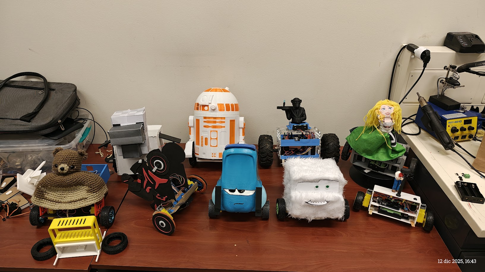

# Proyectos Semestrales
## Curso ME4250 Mecatrónica - Semestre 2025-2

Este directorio consolida los desarrollos técnicos de los grupos de trabajo del semestre. El objetivo principal de este periodo académico fue el diseño, construcción y control de robots autobalancines.

<p align="center">
  
</p>

## Contenido General de los Proyectos

Cada carpeta de proyecto almacenada en este repositorio contiene, de manera estandarizada, los siguientes recursos técnicos necesarios para la replicación y evaluación de los prototipos:

* **Modelos CAD:** Archivos de diseño mecánico y ensamblaje.
* **Electrónica:** Diagramas esquemáticos y de conexión.
* **Firmware:** Códigos fuente y librerías utilizadas.
* **Listas de Materiales (BOM):** Detalle de componentes y presupuesto.
* **Registro Audiovisual:** Evidencia del funcionamiento y validación del sistema.

## Estructura de Directorios

```text
📂 Repositories/
├── Bienvenidos-al-Himalaya/
├── Camarera/
├── CURA-BoT/
├── Guido/
├── La-Gallina/
├── R2-F1P/
├── Robot-Motocicleta/
├── Segway Monkey/
└── WALL-E/

```

## Equipos de Trabajo

A continuación se detalla la conformación de los grupos y la denominación asignada a sus respectivos robots:

| Nombre del Proyecto / Robot | Integrantes del Grupo |
| --- | --- |
| **Bienvenidos-al-Himalaya** | Martín Batarce, Consuelo Laurie, Benjamín Venegas, Santiago Salas, Francisca Suárez |
| **Camarera** | Matteo Zunino, José Contreras, Felipe Campos, Valentina Suárez |
| **CURA-BoT** | Joaquín Gutiérrez, Luisfelipe Muñoz, Marcio Ramírez, Hernán Reyes, Camilo Urra |
| **Guido** | Luis Rosso C., Agustín Montero C., Manuel Pérez R., Emilio Bergez A. |
| **La-Gallina** | Enrique Rebolledo, Félicie Nguyen, Joaquín Poblete, Pablo Varetto, Marina Olmedo |
| **R2-F1P** | Santiago Avila, Diego Gajardo, Leonardo Pizarro, Daniela Quiroz |
| **Robot-Motocicleta** | Bruno Muñoz, Esteban Zamora, Ismail Hamed, Joaquín Roco, Tomás Agurto |
| **Segway Monkey** | Vittorio Giannetti, Francisca Henríquez, Julio Dufflocq, Tomás Wityk |
| **WALL-E** | Camila Aravena, Carlos Aravena, Jan Fergusson, Marcelo Guaquel, Antonella Savoy |

---

**Departamento de Ingeniería Mecánica | Universidad de Chile**
