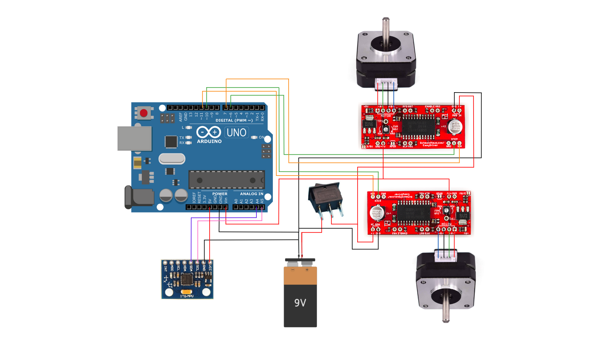

# Proyecto de Mecatrónica: Segway Monkey

## Integrantes: Julio Dufflocq, Bruno Giannetti, Francisca Henríquez y Tomás Wityk.
## Este repositorio fue creado para recopilar todos los archivos asociados al proyecto de robot autobalancín realizado para el ramo ME4250-1 Mecatrónica en la Facultad de Ciencias Físicas y Matemáticas de la Universidad de Chile por el GRUPO 1.

## Índice: 
### 1) Descripción del proyecto
### 2) Carpeta de archivos CAD
### 3) Carpeta de componentes y materiales
### 4) Carpeta de código
### 5) Carpeta de diagramas electrónicos
### 6) Carpeta de registros audiovisuales
(Para este proyecto no se usaron referencias externas a las recomendaciones del eequipo docente. No nos basamos en ningún proyecto de internet ni ocupamos papers académicos sobre el tema.)

## 1) Descripción del proyecto
Aquí podrán encontrar los archivos tipo .f3d, .f3z y .stl ocupados para diseñar e imprimir las diferentes piezas de nuestro robot-mono autobalancín. Escogimos darle al proyeto una estética de chimpancé sobre un Scooter Segway pues nos pareció gracioso y ad-hoc al robot autobalancín ya que los scooters marca Segway ocupan esta tecnología para balancearse.

## 2) Carpeta CAD
El siguiente link es de los archivos CAD que se usaron ([Carpeta CAD](https://github.com/TomasWityk/Proyecto-Mecatronica/tree/c9919a96ce4f7ce4c64e0028fc4ff8c7a873124e/Proyecto%20Mecatronica%20Grupo%201))

## 3) Carpeta de componentes y materiales
**Componentes**

**[1] Arduino Uno:** Permite el procesamiento continuo de señales provenientes del sensor inercial y la ejecución del algoritmo de control en lazo cerrado con tiempos de muestreo adecuados para un sistema dinámico e inestable. La disponibilidad de múltiples pines digitales posibilita el control independiente de las señales STEP y DIR de cada driver, mientras que su soporte nativo para comunicación permite una integración directa y estable con el sensor de orientación.

**[2] Driver HW 135:** Proveen la interfaz eléctrica necesaria entre el microcontrolador y los motores paso a paso, siendo capaces de manejar los niveles de corriente requeridos por motores NEMA 17. La compatibilidad con señales de control STEP y DIR permite un control preciso de la velocidad y el sentido de giro, lo cual es fundamental para traducir las acciones del controlador en correcciones mecánicas proporcionales a la magnitud del error de inclinación.

**[3] Sensor GY-521:** Incorpora un acelerómetro y un giroscopio de tres ejes (X, Y y Z), lo que permite medir tanto aceleraciones lineales como velocidades angulares en los ejes relevantes para la inclinación del robot. En particular, la información del eje de rotación asociado al plano de balanceo resulta esencial para estimar el ángulo de inclinación respecto a la vertical.

**[4] Motores NEMA 17:** Entregan un torque suficiente para generar las fuerzas necesarias que compensan el momento producido por la inclinación del robot. Su capacidad de respuesta y control del desplazamiento angular permite realizar correcciones rápidas y repetibles.

**[5] Baterías de litio recargables (3 × 3,9 V) con portapilas:** Suministran el voltaje y la energía necesarios para alimentar tanto la electrónica de control como la etapa de potencia. La configuración en serie permite alcanzar un nivel de tensión adecuado para el funcionamiento de los drivers.

**[6] Interruptor general:** Permite aislar eléctricamente el sistema completo de la fuente de alimentación, facilitando la realización de pruebas, ajustes y reinicios del sistema de control sin comprometer la integridad de los componentes ni la seguridad del usuario.

**Materiales**
Para las paredes inferiores, superiores y la tapa superior se usó acrilico ya que, estos son componenetes planos y no tienen relieves, por lo cual se pueden cortar con una cortadora laser. Por otro lado, los dos pisos (inferior y superior) y la tapa del piso inferior se fabricaron mediante impresión 3D, esto se hace dado que son piezas que tienen relieves.

Para la sujeción del sirviente chimpancé "Pogo", se usó velcro. También, para sujetar la botella que Pogo sostiene, se usó masilla adhesiva. 

Para las conexiones de todos los componentes electricos a la carcasa se usaron pernos M3 y sus respectivas tuercas. Se usaron los mismos pernos para juntar todas las piezas de la carcasa entre sí.

## 4) Carpeta de código

El siguiente link hace referencia a la carpeta con el código utilizado para el sistema de control PID de nuestro robot. [Código](https://github.com/TomasWityk/Proyecto-Mecatronica/tree/71e3d7fe7eb02406f8a7c89c6a796200511573ef/SEGWAY_MONKEY_PID_FINAL)

## 5) Carpeta de diagramas electrónicos
**Diagrama de conexiones**

El sistema eléctrico del robot atobalancín se alimenta a partir de una batería principal, la cual se conecta inicialmente a un interruptor general. Desde el interruptor, la alimentación se distribuye hacia los drivers de los motores mediante la entrada de potencia (Power In), proporcionando la energía necesaria para el accionamiento de los motores paso a paso NEMA 17.

Los drivers de motor cumplen una doble función dentro del sistema. Por una parte, reciben la señal de control proveniente del Arduino Uno y suministran la corriente adecuada a los motores. Por otra parte, entregan una salida regulada de 5 V, la cual se utiliza para alimentar simultáneamente la placa Arduino.

El control de los motores se realiza a través de las señales digitales STEP y DIR de cada driver, las cuales se conectan directamente a pines digitales del Arduino Uno. La señal STEP determina la cantidad y velocidad de los pasos del motor, mientras que la señal DIR define el sentido de giro. De esta forma, el Arduino es capaz de controlar con precisión el movimiento de los motores en función de la señal de control generada por el algoritmo de balanceo.

El sensor de inclinación GY-521 se alimenta directamente desde la salida de 5 V del Arduino Uno. La comunicación entre el sensor y el Arduino se realiza mediante los pines SDA y SCL, los cuales se encuentran asociados a los pines analógicos del Arduino.

Finalmente, todas las conexiones de referencia eléctrica (GND) del sistema (batería, drivers, Arduino y sensor) se encuentran unidas en un mismo punto común. Esta conexión a tierra compartida es fundamental para garantizar una correcta referencia de voltaje, reducir ruidos eléctricos y asegurar la estabilidad del sistema de control.

**Diagrama de sistema de control**
.png)

El sistema implementado corresponde a un sistema de control en lazo cerrado para un robot autobalanceante. El ángulo de inclinación es medido mediante un sensor GY-521, el cual entrega información de aceleración y velocidad angular. Estos datos son procesados por un Arduino Uno, donde se implementa un controlador PID encargado de generar la señal de control. Dicha señal es enviada a los drivers HW-135, que alimentan los motores NEMA 17, permitiendo corregir la inclinación del robot y mantener el equilibrio.

## 6) Carpeta de registros audiovisuales
En el siguiente link podrán acceder a la carpeta con los registros audiovisuales del proyecto:
([Carpeta registros audiovisuales](https://github.com/TomasWityk/Proyecto-Mecatronica/tree/d7f582911d95c63d2b97696b3192d372937d1184/Registros%20audiovisuales%20Segway%20Monkey))

