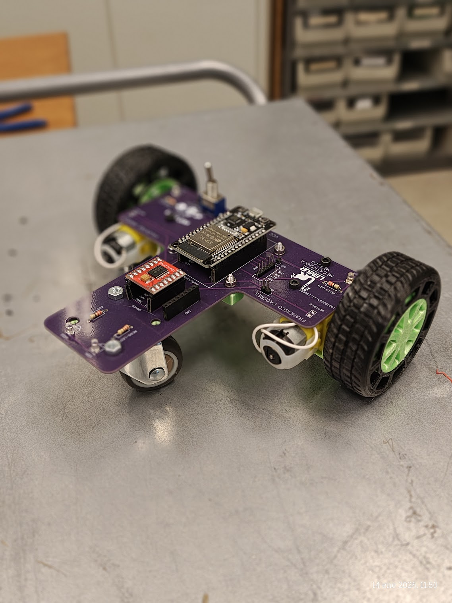
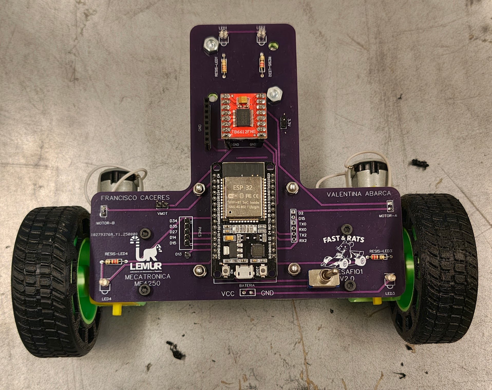

# ME4250 - Desafío 1: El Ratmóvil 🐀🏎️
### Temática: Actuadores Electromecánicos y Motores DC


Vista Isométrica

---


Vista Superior

---
## Contexto: La Liga "Fast & Rats"
Las carreras de autos conducidas por ratones se han vuelto muy populares. Como equipo de ingeniería, el objetivo es preparar nuestro vehículo ("Ratmóvil") y a su piloto para competir en la prestigiosa liga **Fast & Rats**.

En este desafío, nos centraremos en los fundamentos del movimiento robótico: **la actuación**. Deberán lograr que el vehículo se mueva de manera controlada, señalice sus acciones y complete un circuito preestablecido.

## Objetivos del Desafío
La evaluación se centra en la correcta implementación del hardware y software para el control de movimiento:

* **⚡ Arquitectura Electrónica:** Elaboración de un diagrama esquemático claro de las conexiones (Microcontrolador, Drivers, Actuadores) [1].
* **💻 Código de Control:** Desarrollo de un firmware en C++ (Arduino IDE) ordenado y comentado [1].
* **🚦 Señalización y Actuación:** Implementación de funciones para el control de Motores DC y LEDs indicadores (Adelante, Atrás, Izquierda, Derecha) [1].
* **🏁 Prueba de Pista:** Completar satisfactoriamente un circuito mediante una rutina pre-programada o control remoto [1].
* **🔧 Mejora Continua:** Propuestas de optimización del diseño o metodología [1].

## Estructura de Archivos

```text
📂 Desafío_1/
├── 📂 CAD/             # Modelos 3D del chasis (Fusion360 y .step)
├── 📂 Código/          # Firmware (.ino) y librerías utilizadas
├── 📂 Documentos/      # Enunciado oficial (PDF) y Datasheets
├── 📂 Electrónica/     # Esquemas de conexión y PCB del driver
├── 📂 Multimedia/      # Fotos y videos del funcionamiento
└── 📄 README.md        # Este archivo

```

## Componentes y Recursos (BOM)

Para este desafío se utiliza la siguiente configuración de hardware:

| Componente | Descripción |
| --- | --- |
| **MCU** | ESP32 (DOIT ESP32 DEVKIT V1) |
| **Driver de Motor** | TB6612FNG (Puente H Dual) |
| **Actuadores** | 2x Motores DC con caja reductora |
| **Indicadores** | LEDs (Señalización de dirección) |
| **Energía** | Baterías Li-Ion / Li-Po (Ver sección de seguridad) |

## Software Requerido

* **Arduino IDE:** Con el soporte para tarjetas ESP32 instalado.
* **Drivers USB:** CP210x Universal Windows Driver (si no se reconoce el puerto COM) [2].

> **Nota sobre librerías:** Dependiendo de la versión del Core de ESP32, la función PWM puede variar entre `ledcWrite` (versiones antiguas) o las nuevas implementaciones de `LedcAttach`. Revisar la documentación adjunta.

## ⚠️ Seguridad y Precauciones (Safety First)

**¡LEER ANTES DE CONECTAR!**
El manejo incorrecto de la energía puede dañar permanentemente los equipos.

1. **🔥 Cuidado con el USB y las Baterías:**
* **NUNCA** conectes el cable USB al computador si las baterías del robot están puestas y el interruptor está encendido.
* Esto puede generar un retorno de corriente que **dañará el puerto USB de tu computador**.
* *Procedimiento seguro:* Desconecta las baterías antes de cargar código nuevo.


2. **🔋 Polaridad:**
* Verifica siempre la polaridad de las baterías antes de conectarlas. Invertir la polaridad quemará instantáneamente el Driver y el ESP32.


---

**ME4250 Mecatrónica - Facultad de Ciencias Físicas y Matemáticas - Universidad de Chile**