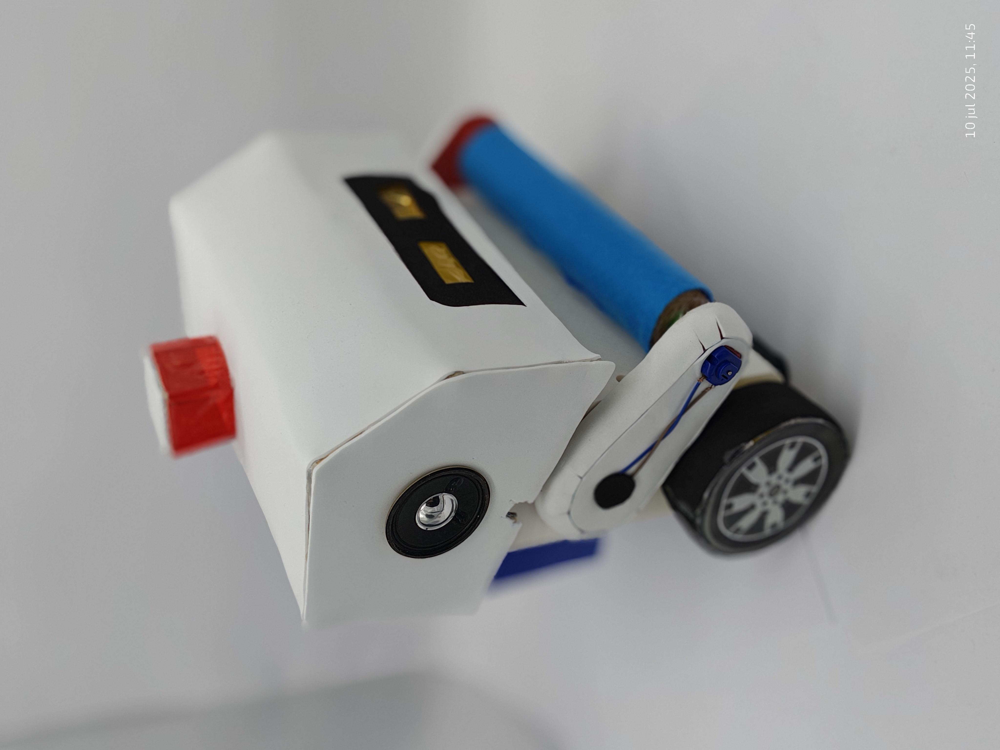

# M4250 Mecatrónica

¡Bienvenido! Este repositorio reúne los proyectos que hicimos en el curso de Mecatrónica ME4250 del semestre de Otoño de 2025. Todos los grupos trabajamos en carros balancines, aplicando el mismo principio del péndulo invertido, pero cada uno le dio su propio estilo y diseño.

Aquí puedes ver los cuatro proyectos principales que presentaron:

1. **M0-V**
   
   
   
   [Link Proyecto](https://github.com/CarlosCornejoM/M0-V.git)

2. **Circus**
   
   

   [Link Proyecto]()

3. **Man On Wire**

   

   [Link Proyecto](https://github.com/201ms/Pengusurf-Club.git)

Además, vas a encontrar ejemplos, ejercicios y recursos útiles para seguir aprendiendo y compartiendo ideas sobre electrónica, programación y robótica.

## ¿Quieres aportar?

Si tienes mejoras, correcciones o quieres sumar tu propio proyecto, puedes hacer un pull request. ¡La idea es que todos aprendamos juntos!

---
